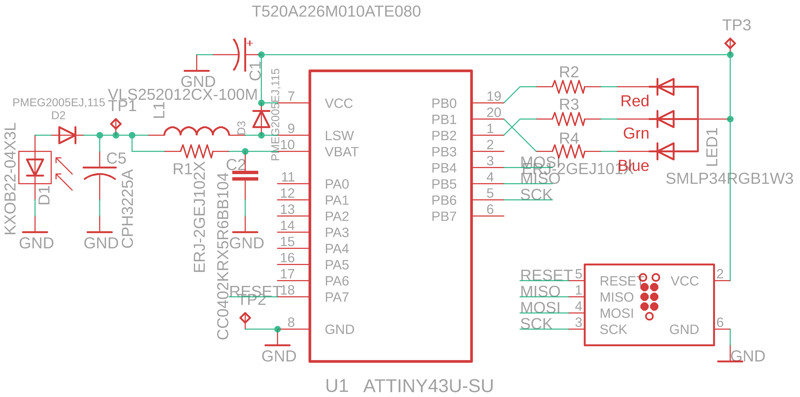
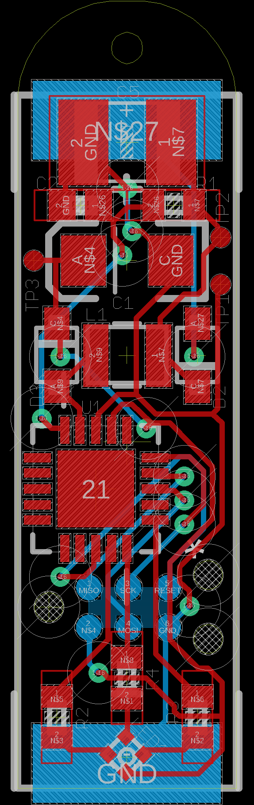

# solar-earrings
A small pair of solar-powered micrcontrollers with onboard RGB LEDs

I was thinking about what could be the smallest possible wearable microcontroller form factor.

Solar powered and other energy harvesting microcontrollers are all the rage, but getting them to stay reliable seems to be difficult. It is helpful to use a current amplifier to monitor junctions in this design.

